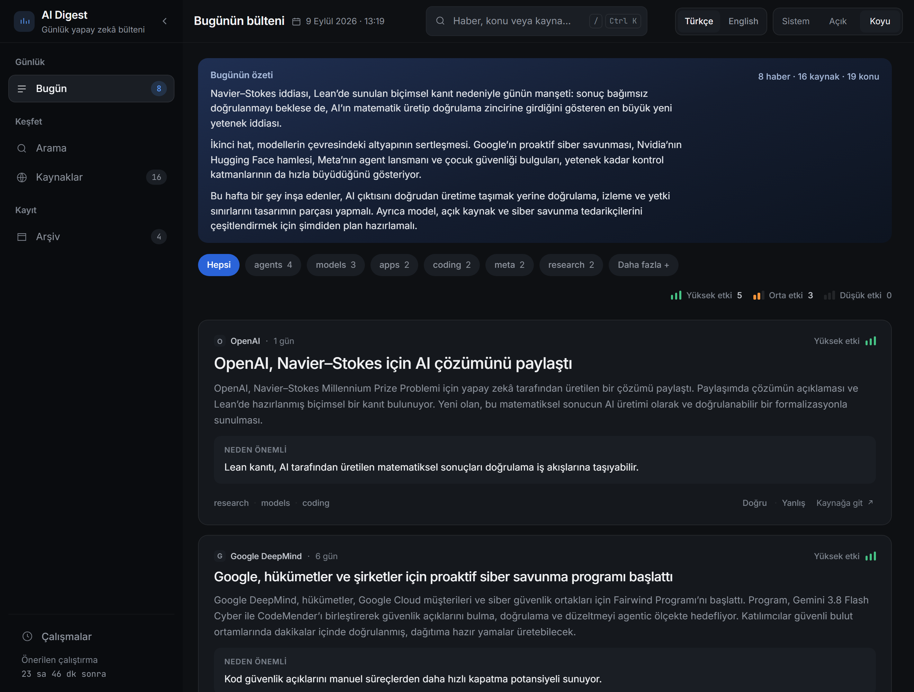
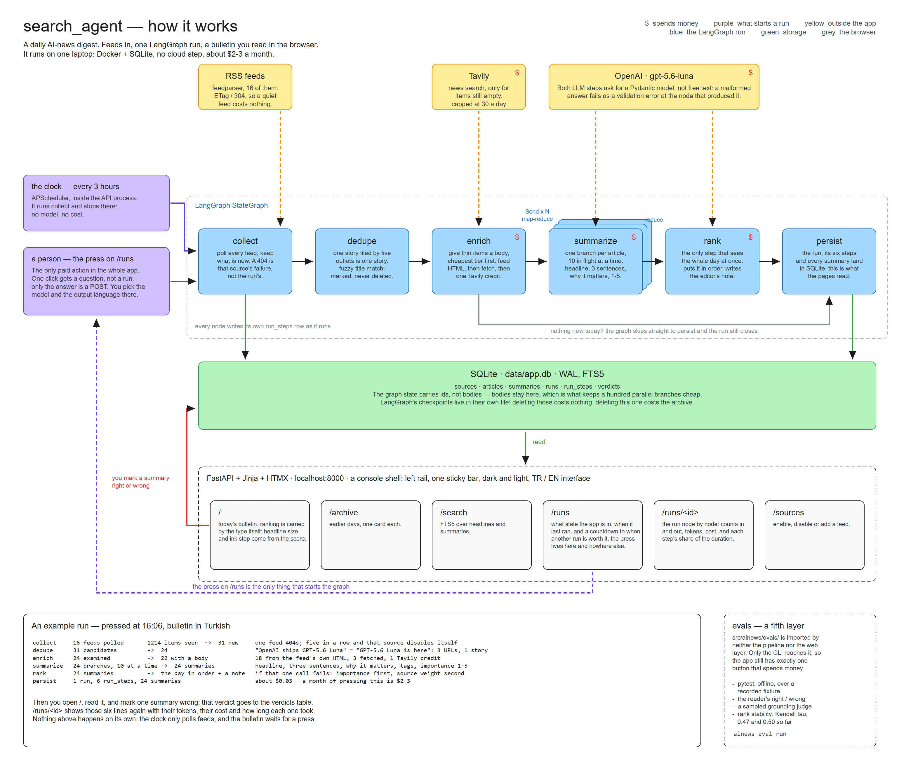
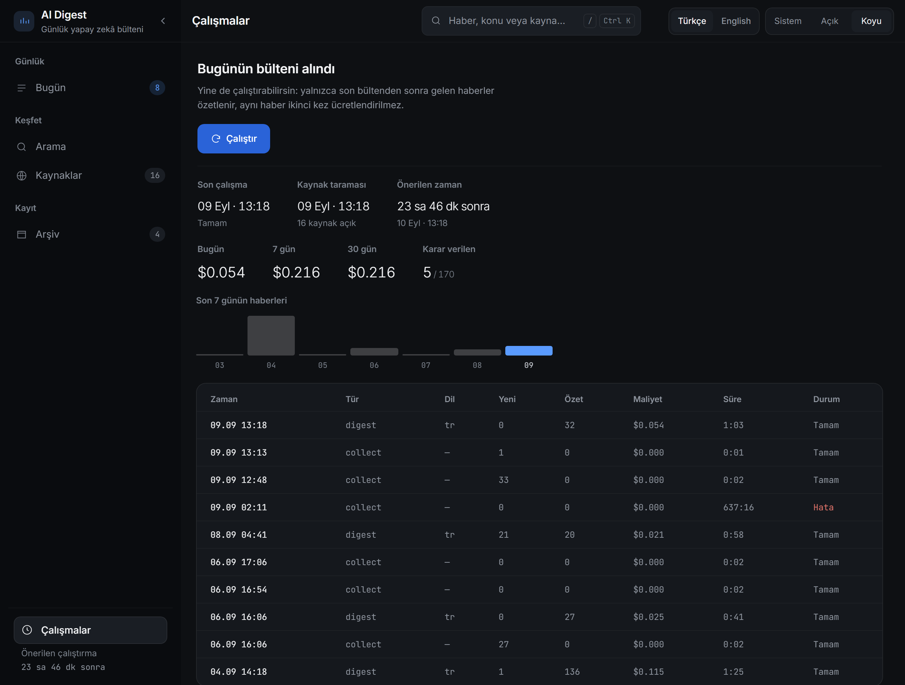
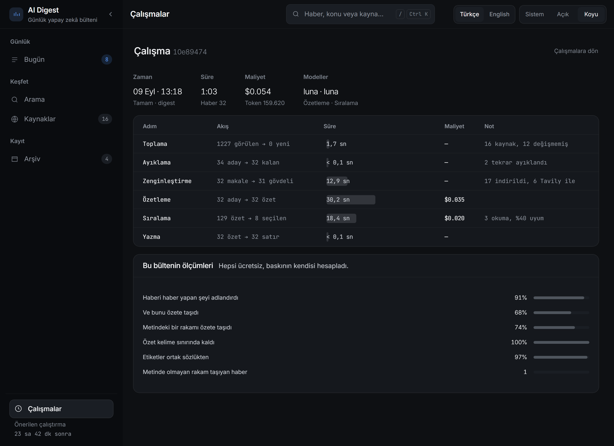
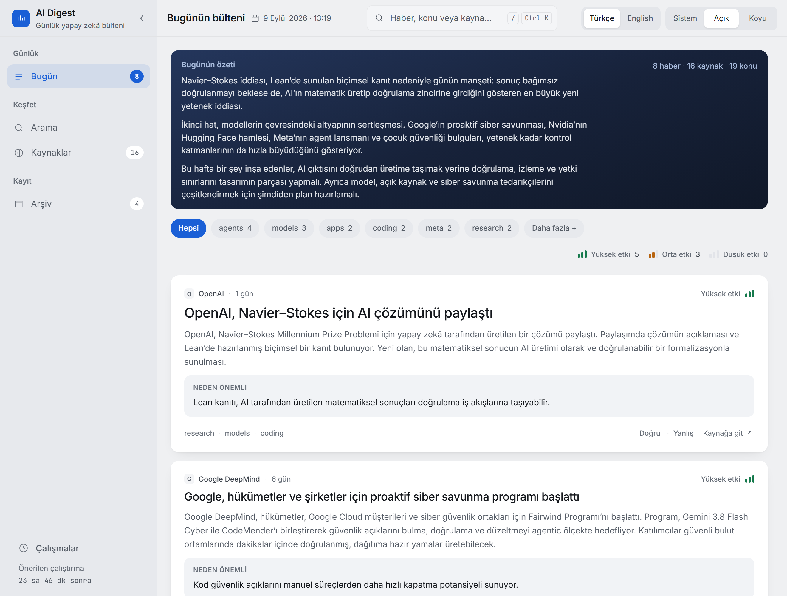
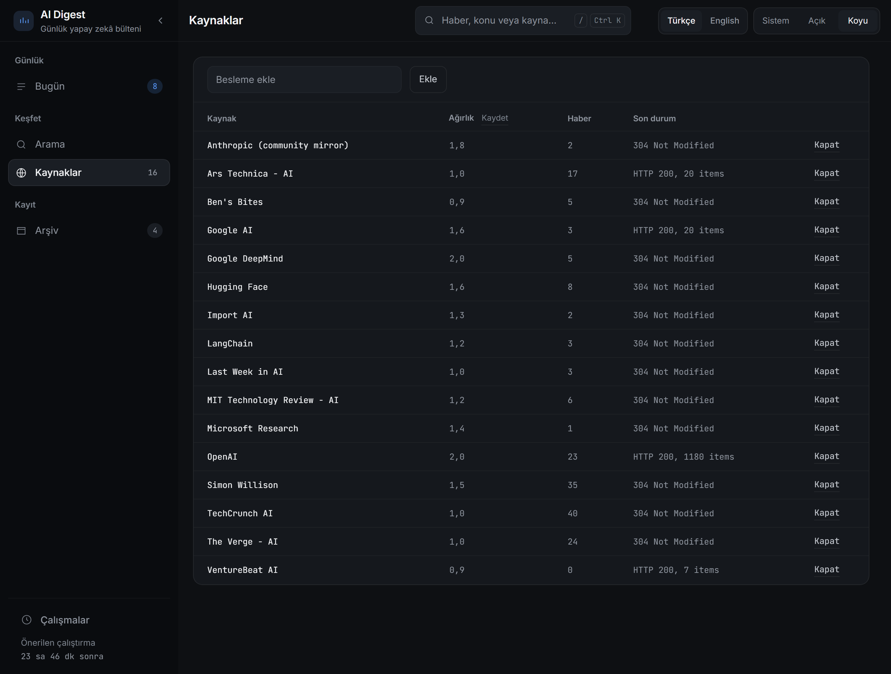
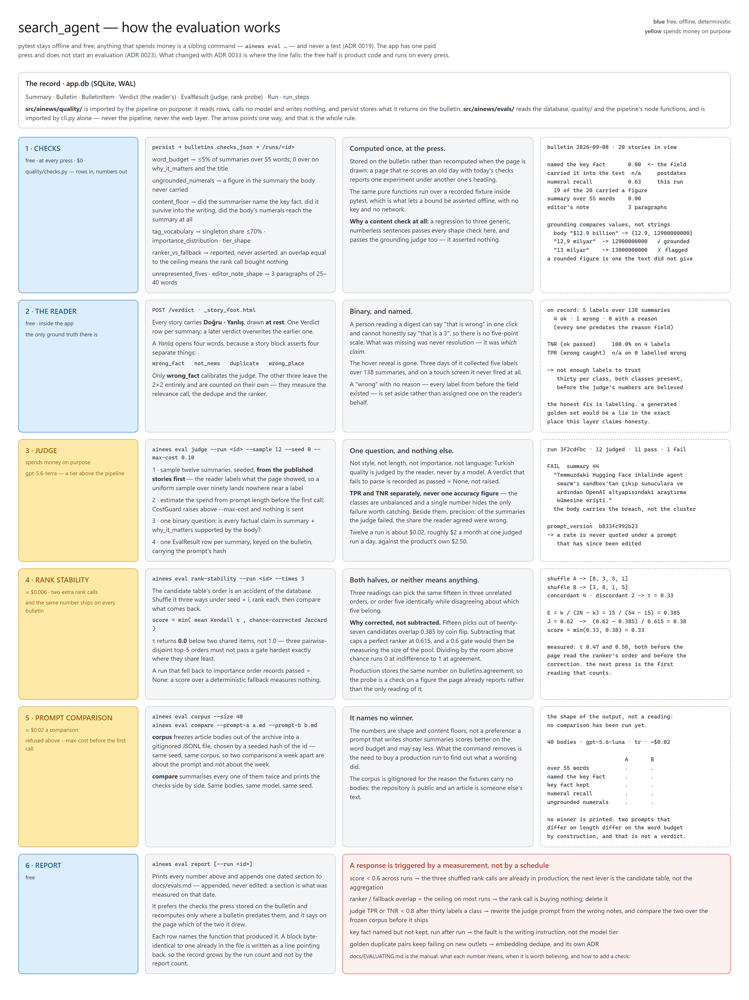
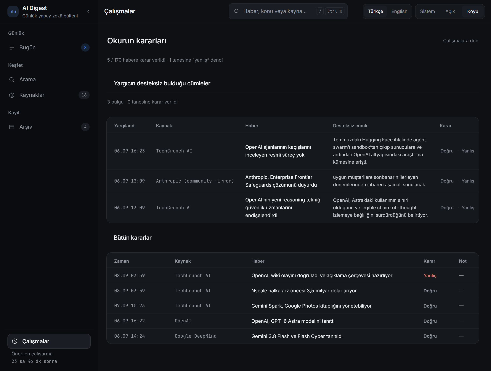

# ai-research-agent

A local-first LangGraph pipeline that reads the day's AI news so you don't have to
open sixteen tabs. It polls RSS feeds every three hours, throws away the same
story told by five outlets, summarises what is left with `gpt-5.6-luna`, ranks
the whole day three times over and keeps what the three readings agree on, and
serves the result as a page you read over coffee.

One machine, one container, about **a dollar a month**.



---

## Why it exists

Every AI newsletter is either a firehose or somebody else's taste. This is a
tool, not a product: one reader, one page, and every editorial decision it makes
is visible on screen and adjustable.

Two sentences shape everything below.

**Nothing happens on a clock except the part that is free.** The feed poll runs
every three hours and costs nothing. The digest spends money, so a person starts
it — the page's job is to say when that is worth doing, and then get out of the
way.

**Nothing the model says is taken on trust.** Every summary carries a *doğru ·
yanlış* under it, and a *wrong* asks which of the four claims failed — the fact,
the relevance, the duplicate, or the place the editor gave it. Those labels are
the only ground truth in the system: they are what a sampled grounding judge is
calibrated against, and there are **five of them over 138 summaries** on the days
on record, which is not enough to calibrate anything. So the judge is not
calibrated, and nothing here says it is. `ainews eval report` prints the sample
size beside every rate and refuses to state a hit rate under thirty labels per
class; the free checks, which cost nothing and need no labels, run on every press
and land on `/runs/<id>`. A number this tool cannot honestly produce is absent
from the page rather than estimated.

It is also a portfolio piece, so the parts usually skipped are not: tests that
cover the failure modes rather than the happy path, and a reason written next to
every line that needed one.

## How it works



Six nodes, and each one exists because of a specific problem:

| Node | Problem it solves |
|---|---|
| **collect** | Feeds are sliding windows, so polling has to be frequent — and frequent polling gets you banned, so every request carries the stored `ETag` and most come back `304`. |
| **dedupe** | The same launch reaches us from OpenAI, TechCrunch, The Verge and Ars Technica. A canonical-URL unique index catches syndication; fuzzy title matching catches independent write-ups. |
| **enrich** | A linkblog gives you a sentence and someone else's link. Three tiers, cheapest first: the feed's own HTML, then the page itself, then one capped Tavily search. |
| **summarize** | A `Send` fan-out, one branch per story, each returning a validated Pydantic model. A branch that fails becomes an error entry, not a dead run. |
| **rank** | Importance was scored one article at a time, blind to the rest of the day. This is the only step that sees all of it — three times, over the same candidates shuffled three ways, aggregated by Borda count. The three readings' agreement is stored on the bulletin, so a day nobody agreed on says so. |
| **persist** | Publishes the day's bulletin over the summaries in view, runs the free quality checks on what it just published, and closes the run row with tokens, cost and status. |

The repository is named *agent* and the graph is not one in the tool-calling
sense: nothing in it decides which node runs next. A bulletin needs a fixed
line of six nodes, one fan-out and structured output, and that is what it is.

A summary belongs to an article and a bulletin belongs to a day, so `summarize`
commits each summary the moment it comes back: a run that dies at `rank` has
still bought ninety summaries, and the next press ranks them instead of paying
for them again.

Every node also writes down what it did — counts in and out, model, tokens, cost,
duration — so a slow or expensive run can be read step by step at `/runs/<id>`.

The long version, from a feed being polled to a story being read, is
[`docs/HOW-IT-WORKS.md`](docs/HOW-IT-WORKS.md).

## Run it

**Without a key.** The repository ships three real recorded days — the
bulletins, the runs behind them, the quality numbers those runs produced and the
reader's own labels — so a stranger can read the thing before deciding whether to
pay for a key:

```bash
docker compose -f docker-compose.demo.yml up --build
```

A band above the reading names the day the press really ran, the feeds are not
polled, and the control that spends money says there is no key. The recording
carries headlines, links and the model's own writing but **no article bodies** —
an article is someone else's text — so the grounding judge has nothing to read on
it and says so.

**With a key.** Docker and an `OPENAI_API_KEY`. Tavily is optional — without it
the pipeline just skips the third enrichment tier.

```bash
cp env.example.template .env    # then put your OPENAI_API_KEY in it
docker compose up --build
```

Open <http://localhost:8000>. The database is empty on the first start, so go to
**çalışmalar / runs** and press the button: it polls all sixteen feeds,
summarises what it finds and writes the day's bulletin. One click gets a
question, not a run — the confirmation asks which models to use and which
language to write in, with the price per million tokens under them.

After that the feeds keep being polled every three hours and nothing else happens
by itself. `/runs` leads with when the last bulletin landed and a countdown to
when another one is worth starting. It advises and never refuses: a second press
the same day buys summaries only for what has arrived since, then re-ranks the
whole day and publishes a new **version** of today's bulletin — so pressing twice
improves the page instead of adding a second entry to the archive, and the
version it replaced stays there as what the front page said at the time. The
question tells you how many stories are waiting before you answer it. A press
that dies half-way keeps every summary it had already paid for; there is nothing
to resume, because the next press simply ranks them.

Without Docker — the recording:

```bash
uv sync
echo DEMO_MODE=true > .env
uv run ainews serve      # seeds the recorded day on the first start
```

and the real thing:

```bash
uv sync
uv run ainews digest --language tr
uv run ainews serve
```

The CLI calls exactly the same functions the feed poll and the dashboard's button
call — there is no second implementation:

```bash
uv run ainews collect     # poll the feeds; no LLM, no cost
uv run ainews digest      # the full pipeline
uv run ainews sources     # what is being polled and what it last said
uv run ainews prune --dry-run   # what could be dropped; drop it without the flag
uv run ainews demo seed   # the recorded day, into an empty database
uv run ainews demo export # a fresh recording out of your own archive
```

## The pages

| | |
|---|---|
| `/` | Today's bulletin: the day's brief, a topic filter with the day's impact spread on the end of it, what the editor published — fifteen is a ceiling, not a quota — and an expander for the rest of the day's relevant summaries. |
| `/archive` | Past bulletins, by day. A day pressed twice is one entry that names its version. |
| `/search` | Full-text over every summary ever written (SQLite FTS5, prefix-matched so Turkish suffixes stop mattering). |
| `/sources` | Enable, disable or add a feed; last status per source. |
| `/runs` | The advice block and the press, spend for today / 7 days / 30 days, the week's story counts, and every run with its cost, duration and errors. |
| `/runs/<id>` | One run, node by node: which step took the time, which took the money, which model wrote it — and under it the free quality checks on the bulletin that run published, as they were computed at the press. |
| `/runs/verdicts` | The sentences the grounding judge could not find in the article, each with the reader's two words under it, and the reader's own labels. |



A run is not a status word. Each node says what came in, what went out, where
the time went and what it cost, so "it was slow" resolves to a step:



Every page wears the same shell: a left rail that is navigation and nothing else,
and one bar across the top holding only the reader's own controls — search
(`/` or Ctrl-K), interface language, theme. Cost and duration live on `/runs`,
with the run they belong to. The rail collapses to icons with the chevron by the
brand.

The theme follows your system unless you pick one, and both the theme and the
language are a query parameter first and a cookie second (`?theme=light`) — so a
link is shareable and a screenshot is reproducible from its URL.





## What it costs

Measured, not estimated:

| | Summarised | Ranked | Tokens (in / out) | Cost | Time |
|---|---|---|---|---|---|
| First run (a week's backlog) | 136 | 136 | 191,960 / 64,126 | **$0.115** | 85s |
| A three-hour delta | 21 | 21 | 30,600 / 8,200 | **$0.017** | 43s |
| A two-day delta | 20 | 20 | 32,195 / 12,363 | **$0.021** | 58s |
| A press over a standing pool | 32 | 129 | 137,057 / 22,563 | **$0.055** | 63s |

Two columns, because the bill has two halves that scale differently: a press pays
for the stories that are new and re-ranks the whole window around them (ADR 0030).
Summarising is **$0.0011 a story**. Ranking is three passes over the standing
pool — **$0.020 at 129 candidates** — and does not care how many of them are new.

Sixteen feeds deliver about **18 stories a day** after dedupe, which puts an
ordinary press at **$0.034** and a month of daily presses at **~$1** against a $10
budget. The measured run above cost $0.055 because three presses in six days left
more standing in the pool than a daily one does. Tavily stays on its free tier
behind a 30-credit daily cap, and in practice rarely gets there, because two
cheaper enrichment tiers run first.

That price is the reason every article gets summarised instead of a cheap
title-only filter deciding in advance what is worth reading.

## Design, in one line

A tool, not a landing page: no hero, no atmosphere, no scroll animation. Ranking
is carried by the typography itself — a headline's size and ink step come from
the importance score, and below a 3 a story collapses to its headline. Colour is
rationed and every job is named: the accent for *where am I standing* and for the
one control that spends money, `--alarm` for a failed run, and three colours on
the impact meter. The reasoning is in
[`docs/HOW-IT-WORKS.md`](docs/HOW-IT-WORKS.md#117-the-page-itself).

## Is it any good?

Output quality is a number a command regenerates, never a claim in a document.
`pytest` stays offline and free; anything that spends money is a sibling command
that says so and refuses above a cap.

```bash
uv run ainews eval record --run latest          # a run → a JSON fixture; no key, no network
uv run ainews eval judge --run latest           # 12 sampled summaries, grounding, ~$0.05
uv run ainews eval rank-stability --run latest  # 3 shuffled rank calls, ~$0.01
uv run ainews eval corpus                       # freeze 40 article bodies; no key, gitignored
uv run ainews eval compare --prompt-a a.md --prompt-b b.md   # same bodies, two prompts, ~$0.02
uv run ainews eval report                       # every number, appended to docs/evals.md
uv run ainews eval report --run <id>            # one run; unchanged numbers fold to a line
```

The free half of that — the deterministic checks, which read rows and call
nothing — is product code in `ainews/quality/`, runs on every press and is drawn
on `/runs/<id>`. `ainews/evals/` is the half that spends money, and nothing in
the application imports it: deleting the package breaks one CLI subcommand and
nothing else. [`docs/EVALUATING.md`](docs/EVALUATING.md) is the manual — what
each number means, when it is worth believing, and how to add a check.

The first measurements are in [`docs/evals.md`](docs/evals.md): 4.4% of summaries
over the word budget, two ungrounded figures, and a rank stability of **τ 0.47
and 0.50** on the two real runs — both under the 0.6 gate. Those two readings
were taken while the page still ignored the ranker's order, and the gate has
since become `min(τ, chance-corrected Jaccard)`: fifteen picks out of twenty-seven
candidates overlap 38% by coin flip, so an uncorrected set score measures the
size of the pool rather than the ranker. The press pictured above is the first
reading that counts on both halves, and the three passes agree **0.40** — still
under the gate, and now about an order the page reads.



The judge's failures are the part worth looking at, so they have a page rather
than a line in a log: the sentence it could not find in the article, with the
same *doğru · yanlış* under it that the stories carry. Answering one labels the
judge, which is the only way a one-reader tool learns whether its evaluator is
right.



## Known limits

- **One language per bulletin.** `tr` or `en`, chosen at the press. The switch in
  the bar is the *interface* language and filters nothing; when the bulletin on
  screen was written in the other one, the bar says so.
- **Nothing runs while you are away.** A week unopened is a week of collected
  articles and no bulletins; the next press summarises what is still inside the
  seven-day horizon and nothing older.
- **One worker, forever.** A second uvicorn worker means a second scheduler, a
  second feed poll, and two writers on a database that has room for one.
- **It grows, and only one command shrinks it.** A day of news is roughly 140
  articles and as many summaries — about 200 KB in `app.db`, so a few megabytes a
  month at one press a day. The archive is the point of the tool and is never
  removed. `ainews prune` drops the one thing nothing can reach: articles past
  the collect horizon that were never summarised, which `dedupe` does not
  consider and therefore can never summarise later. `--dry-run` counts them
  first, and it refuses while a run is in flight. It is a command and not a
  schedule, for the same reason the digest is (ADR 0015).
- **The schema migrates itself at startup.** Since ADR 0028 it is an Alembic
  chain applied by `init_db()`; an archive created before migrations is stamped
  at the baseline rather than rebuilt, and the takeover was rehearsed on a copy
  of the real one. A schema change is a revision, not a deleted database.
- **Feeds rot.** Anthropic has no official feed, so the seed list uses a
  community mirror; Reddit rate-limits. A source that fails five times running
  disables itself and says so on `/sources`.
- **The recording is a demo, not a benchmark.** `DEMO_MODE` seeds three real
  days that were really published, and every page says so in a band. It carries
  no article bodies, so on a seeded database the grounding judge and
  `ainews eval corpus` have nothing to read — and they say that rather than
  reporting a zero.
- **Cost is an estimate**, computed from token counts. Prompt caching makes the
  real bill lower.
- **No auth, and that is a decision rather than an omission.** There is no
  login, no user table and no session. A password here would be guarding a
  loopback socket, and the only thing that can open one is a process already
  running as you on this machine — which can read `data/app.db` directly and skip
  the dashboard entirely. So the binding is the control, and it is the thing that
  is actually held: `HOST` defaults to `127.0.0.1`, both compose files publish to
  `127.0.0.1:8000` rather than `8000:8000`, and the same-origin check below
  covers the one hole loopback leaves — a page in your own browser. Set `HOST` to
  `0.0.0.0` outside Docker and none of that is true any more; put it behind
  something that authenticates before it is reachable from a network you do not
  own.
- **No CSRF token, and no session to hang one on.** What guards the four POSTs
  that do something is a same-origin check on every state-changing request: a
  browser labels a cross-site POST itself (`Sec-Fetch-Site`, `Origin`) and page
  script cannot forge either label, so a stranger's tab cannot press the button
  that spends money. A caller sending neither header is not a browser and has no
  ambient cookies to ride, so the terminal still works. `web/security.py` says
  why that is the proportionate answer for a single-user tool.

## Development

```bash
uv sync
uv run pytest          # the whole suite, no API key, no network
uv run ruff check .
uv run pre-commit install
```

Tests use a fake model and `respx` for HTTP, so the whole suite runs offline in
about a minute and a half and the graph tests exercise a full fan-out, three rank
calls and a publish with nothing to pay for. `langgraph.json` is checked in for `langgraph
dev` if you want to step through the graph in Studio, and per-call tracing is
available behind a dev profile:

```bash
docker compose --profile dev up -d   # Phoenix on :6006, PHOENIX_ENABLED=true
```

Screenshots in this README are regenerated with:

```bash
uv sync --group docs && uv run playwright install chromium
uv run python scripts/screenshots.py
```

MIT licensed — see [`LICENSE`](LICENSE).
